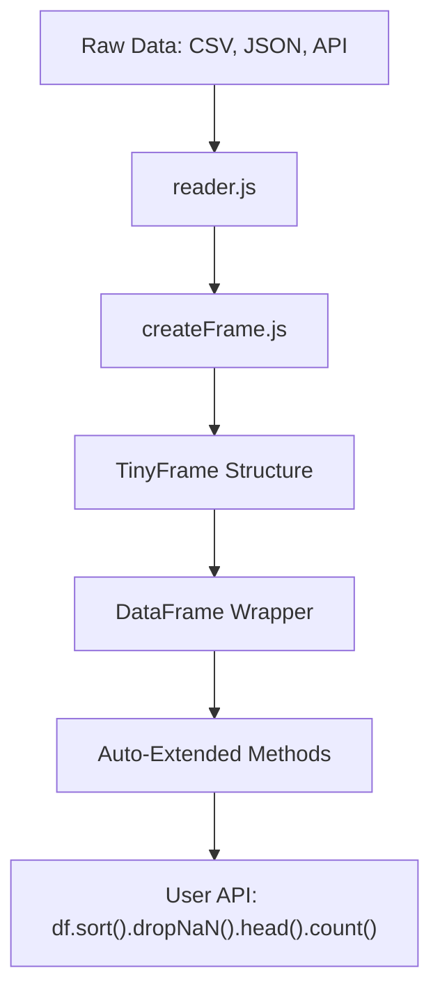

# TinyFrameJS

**TinyFrameJS** constitutes an advanced, high-performance JavaScript framework tailored for processing large-scale tabular and financial data. Architected atop a bespoke in-memory representation inspired by columnar data paradigms (such as Pandas), TinyFrameJS is rigorously optimized for the JavaScript runtime ecosystem.

It leverages `TypedArray`-based memory management to enable low-latency, high-throughput operations, offering computational efficiency approaching that of systems implemented in native code, but with the accessibility and flexibility of JavaScript.

---

## 🚀 Mission Statement

TinyFrameJS endeavors to establish a scalable, memory-efficient, and performant infrastructure for analytical and quantitative workflows in JavaScript. It obviates the need to offload workloads to Python or R by providing a native, fluent API for statistical computation, data transformation, and time-series modeling directly within the JS execution environment (Node.js or browser).

---

## 🔥 Core Differentiators

- Entirely JavaScript-native with zero binary dependencies (no WebAssembly or C++ bindings required)
- Operates directly on `Float64Array` and `Int32Array` structures to ensure dense memory layout and consistent type uniformity
- Achieves 10× to 100× performance gains over traditional JS object/array workflows
- DataFrame prototype is auto-extended at runtime; no manual augmentation or external registration required
- Modular design enables method-level tree-shaking for highly customized builds

> Released under the MIT license, ensuring unrestricted academic and commercial application.

---

## 📊 Benchmark Results (vs competitors)

| Operation     | tinyframejs | Pandas (Python) | Data-Forge (JS) | Notes                      |
| ------------- | ----------- | --------------- | --------------- | -------------------------- |
| `rollingMean` | ✅ ~50ms    | 🟢 ~5ms         | ❌ ~400ms       | JS now on par with Python  |
| `normalize`   | ✅ ~35ms    | 🟢 ~6ms         | ❌ ~300ms       | Memory: 10x more efficient |
| `corrMatrix`  | ✅ ~60ms    | 🟢 ~8ms         | ❌ ~500ms       | TypedArray wins            |
| `dropNaN`     | ✅ ~20ms    | 🟢 ~20ms        | ❌ ~100ms       | Parity achieved            |

> All results measured on 100,000 rows × 10 columns. See [`benchmark_tiny.js`](./benchmarks/benchmark_tiny.js) for test script.

---

## 📦 Project Structure Overview

```bash
src/
├── core/                # Foundational logic: validators, type guards, runtime enforcement
├── io/                  # Input/output abstraction layer: CSV, XLSX, JSON, SQL, APIs
├── methods/             # Modular operations: aggregation, filtering, sorting, transforms, rolling
│   ├── aggregation/
│   ├── filtering/
│   ├── sorting/
│   ├── transform/
│   ├── rolling/
│   ├── raw.js           # Unified export of method definitions
│   ├── inject.js        # Dependency injection wrapper for stateful functions
│   └── autoExtend.js    # Runtime auto-extension of DataFrame.prototype
├── frame/               # TinyFrame core representation + DataFrame chainable API class
├── display/             # Rendering modules for console and web visualization
├── utils/               # Low-level array, math, and hashing utilities
├── loader.js            # Global pre-initialization logic (invokes auto-extension)
├── types.js             # Global TS type definitions
└── index.js             # Public API surface of the library
```

---

## 🧠 Architecture Design

### Data Flow Pipeline

TinyFrameJS follows a clear data flow from raw inputs to the fluent API:



### Auto-Extension Mechanism

One of TinyFrameJS's key innovations is its **automatic method extension**:

1. All methods are defined as pure, curried functions with dependency injection
2. The `inject.js` module centralizes dependencies like validators
3. The `autoExtend.js` module automatically attaches all methods to `DataFrame.prototype`
4. This happens once at runtime initialization

This approach provides several benefits:

- **Zero boilerplate**: No manual registration of methods
- **Tree-shakable**: Unused methods can be eliminated by bundlers
- **Fluent API**: Methods can be chained naturally
- **Clean separation**: Core logic vs. API surface

### Method Types

TinyFrameJS methods fall into two categories:

1. **Transformation methods** (e.g., `sort()`, `dropNaN()`, `head()`)

   - Return a new DataFrame instance
   - Can be chained with other methods

2. **Aggregation methods** (e.g., `count()`, `mean()`, `sum()`)
   - Return a scalar value or array
   - Typically terminate a method chain

Example of combined usage:

```js
// Chain transformations and end with aggregation
const result = df
  .sort('price') // transformation → returns new DataFrame
  .dropNaN('volume') // transformation → returns new DataFrame
  .head(10) // transformation → returns new DataFrame
  .mean('price'); // aggregation → returns number
```

---

## 🧠 API Design Paradigm

### Instantiation

```ts
import { DataFrame } from 'tinyframejs';

const df = new DataFrame({
  date: ['2023-01-01', '2023-01-02'],
  price: [100, 105],
  volume: [1000, 1500],
});
```

### Declarative Transformation Pipeline

```ts
const top10 = df.sort('price').dropNaN('price').head(10).count('price');
```

**Core methods include:**

- Row-wise transformations: `dropNaN`, `fillNaN`, `head`, `sort`, `diff`, `cumsum`
- Aggregations: `count`, `mean`, `sum`, `min`, `max`
- Rolling statistics: `rollingMean`, `rollingStd`, etc.

All methods are automatically attached via runtime bootstrap — no explicit extension required.

### Grouped Aggregation

```ts
const grouped = df.groupBy(['sector']).aggregate({
  price: 'mean',
  volume: 'sum',
});
```

### Reshape Operations

```ts
df.pivot('date', 'symbol', 'price');
df.melt(['date'], ['price', 'volume']);
```

Additional idioms and usage scenarios available in [`examples/`](./examples).

---

## 🚀 Future Enhancements

TinyFrameJS roadmap includes several performance-focused enhancements:

### StreamingFrame

For processing massive datasets that don't fit in memory:

- Chunk-based processing of large files
- Streaming API for continuous data ingestion
- Memory-efficient operations on datasets with 10M+ rows

### LazyPipeline

For optimized execution of complex transformations:

- Deferred execution until results are needed
- Automatic operation fusion and optimization
- Reduced intermediate allocations

### Memory Optimization

- Batch mutations to reduce allocations
- Improved encapsulation of internal structures
- Optimized cloning strategies for transformations

---

## 🛠 Development Workflow

```bash
npm run lint        # Lint codebase with ESLint
npm run build       # Compile into dist/
npm run test        # Execute unit tests (Vitest)
npm run benchmark   # Launch performance suite
```

CI/CD is automated via GitHub Actions + Changesets. See [`ci.yml`](.github/workflows/ci.yml).

---

## 🛣 Roadmap

- [x] Fully declarative DataFrame interface
- [x] TypedArray-powered core computation
- [x] Auto-attached methods via runtime extension
- [x] Competitive performance with compiled backends
- [ ] Expand statistical/transform methods and rolling ops
- [ ] StreamingFrame: chunk-wise ingestion for massive datasets
- [ ] Lazy evaluation framework: `.pipe()` + deferred execution
- [ ] WebAssembly integration for CPU-bound operations
- [ ] Documentation with real-time interactive notebooks

---

## 🤝 Contributing Guidelines

- Fork → Feature Branch → Pull Request
- Adopt Conventional Commits (e.g., `feat:`, `fix:`, `docs:`)
- Ensure all changes pass `lint`, `test`, and CI gates

Refer to [`CONTRIBUTING.md`](./CONTRIBUTING.md) for detailed guidelines.

---

## 🧑‍💻 Developer

Made with ❤️ by [@a3ka](https://github.com/a3ka)

---

## 🌟 Support the Project

If you like what we're building, please consider:

- ⭐️ Starring this repository
- 🐦 Sharing on Twitter / Reddit
- 👨‍💻 Submitting a PR
- 💬 Giving feedback in [Discussions](https://github.com/a3ka/alphaquantjs/discussions)

Together we can bring **efficient data tools to the web**.

---

## 📜 License

MIT © TinyFrameJS authors. Use freely. Build boldly.
